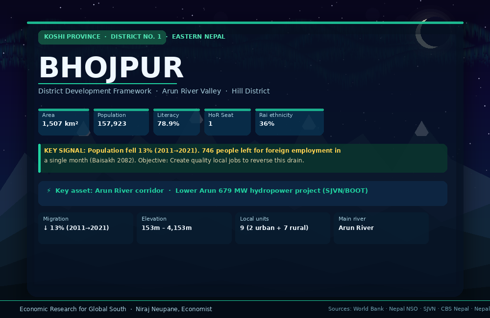

# District 01 — Bhojpur | भोजपुर जिल्ला

**Province:** Koshi | **Ecological Belt:** Hill | **HoR Constituencies:** 1

---

## Quick Stats

| Indicator | Value | Note |
|---|---|---|
| Population (2021 Census) | 157,923 | ↓ 13% from 182,459 in 2011 |
| Area | 1,507 km² | 153m – 4,153m elevation |
| HoR Constituency | 1 | Electorate: 123,379 |
| Literacy rate | 78.9% | Above national average |
| Dominant ethnicity | Rai (36%) | Kirat 36% by religion |
| Local government units | 9 | 2 urban + 7 rural municipalities |
| Administrative HQ | Bhojpur Municipality | |
| Key river | Arun River | 679 MW hydro corridor |

**Largest outmigration signal:** In Baisakh 2082 (May 2025) alone, 746 people from Bhojpur left for foreign employment. The population fell 13% in one decade — the primary development challenge.

---

## Animated District Profiles

| Language | File |
|---|---|
| English | [bhojpur_animated_en.gif](assets/bhojpur_animated_en.gif) |
| नेपाली | [bhojpur_animated_np.gif](assets/bhojpur_animated_np.gif) |

---

## Existing Income Sources

| Source | Details | Commercial Status |
|---|---|---|
| **Agriculture** | Maize, millet, rice, vegetables | Subsistence + semi-commercial |
| **Akabare Chili** | 400 ha, 900 farmers, Pauwadungma RM | National model — commercial |
| **Cardamom** | Major producing district (Koshi belt) | Commercial — mostly India export |
| **Ginger** | Hill slopes across multiple municipalities | Semi-commercial |
| **Khukuri crafts** | Nepal's khukuri capital, centuries-old | Artisan — unorganized |
| **Remittances** | Primary income stabilizer | Structural dependency |
| **Hydropower** | Lower Arun 679 MW (SJVN BOOT) + Darmakhola | Emerging |
| **Tourism** | Hatuwagadhi, Salpa Pond, Chamere Cave, Temke Maiyung | Nascent — severely underfunded |

---

## Infrastructure — Current State

| Infrastructure | Status | Gap |
|---|---|---|
| Road access | Koshi Highway main artery; rural roads improving | Landslide vulnerability; Arun bridge fragility |
| Electricity | Grid expanding; Darmakhola project operational | Lower Arun 679 MW — transforms profile by ~2029 |
| Cold chain / storage | **Absent** | Major post-harvest value loss on chili, cardamom, ginger |
| Agro-processing facility | **None** | No organized processing plant in district |
| Cooperatives | 17 of district's coops are **inactive** | Credit delivery infrastructure exists but dysfunctional |
| Tourism infra | Rs 50,000/year municipal budget for Chamere Cave | No trails, signage, homestay standards, or digital presence |

---

## Priority Development Interventions

| # | Intervention | Description | Timeline | Priority |
|---|---|---|---|---|
| 1 | **Akabare Chili Processing Unit** | Drying, grinding, packaging, "Bhojpur Red" export brand | Year 1–2 | 🔴 High |
| 2 | **Khukuri Industrial Cluster + GI Brand** | Organized workshops, quality grading, e-commerce export | Year 1–3 | 🔴 High |
| 3 | **Cold Storage + Multi-Commodity Hub** | Cardamom, ginger, chili — reduce post-harvest losses | Year 1–2 | 🔴 High |
| 4 | **Cooperative Revival + SME Lending** | Reactivate 17 inactive coops → credit for 3,000+ households | Year 1 | 🔴 High |
| 5 | **Eco-Cultural Tourism Circuit** | Hatuwagadhi–Salpa–Chamere–Temke trail + homestay network | Year 2–4 | 🟡 Medium |
| 6 | **Vocational & Skills Training Centre** | Hospitality, agro-tech, fabrication, digital — 78.9% literate base | Year 1–3 | 🟡 Medium |
| 7 | **Hydropower-Linked Light Industry** | Use Lower Arun power for food processing + manufacturing | Year 3–6 | 🔵 Long-term |

---

## Market Opportunities

### 🌶 Akabare Chili
- **Price:** Rs 250–400/kg fresh · Rs 800–1,200/kg dried
- **Domestic (50%):** Kathmandu valley hotels, restaurants, food processors
- **Local (31%):** Koshi corridor markets
- **India (11%):** Direct border trade
- **Export (3%+):** USA — test consignment confirmed strong reorders; Hong Kong; South Asia diaspora
- **Opportunity:** GI-branded dried powder + pickle → EU & US specialty food market. Processed price: $40–60/kg vs $3/kg raw.

### ⚔ Bhojpure Khukuri
- **Price:** $30–$150 retail · $17–$45 wholesale FOB Kathmandu
- **Domestic:** Kathmandu tourist shops, army & police procurement
- **Export markets:** UK 24%, Canada 25%, Australia 10%, USA (fastest-growing), Netherlands, South Korea, Malaysia
- **Buyers:** Survivalists, collectors, martial artists, Gurkha veterans, outdoor enthusiasts
- **Opportunity:** GI protection + artisan certification → $100–$300 luxury collector tier. D2C online bypasses Kathmandu middlemen.

### 🌿 Large Cardamom
- **Price:** Rs 1,200–2,000/kg — one of the world's highest-value spices
- **Export:** India absorbs 99%; re-exported to Pakistan (60%) and Middle East for biryani
- **Opportunity:** Direct Pakistan/Gulf export bypassing India = 30–40% price premium. Requires Nepal govt bilateral trade negotiation.

### 🏔 Eco-Cultural Tourism
- **Target price:** $80–120/night · $500–800 per trek package
- **Source markets:** India & SAARC (31% of Nepal arrivals), Europe 21% (Germany, UK, France), China (2nd largest)
- **Opportunity:** Bundle — Arun river rafting + khukuri forging workshop + chili farm experience = Rs 25,000+ package.

---

## Employment Potential — 6-Year Outlook

| Sector | Direct Jobs | Upstream/Downstream |
|---|---|---|
| Agri-processing (chili, ginger, cardamom) | 500–800 | 3,000+ farm income gains |
| Khukuri export cluster + GI brand | 400–700 artisan jobs | Logistics, e-commerce, retail |
| Eco-cultural tourism circuit | 200–400 | Guides, homestay, F&B, crafts |
| Hydropower-linked light industry (post-2028) | 500–1,000 | Skilled + semi-skilled manufacturing |
| **Total** | **1,600–2,900** | **Could reverse outmigration trend** |

---

## Financing Sources

| Source | Type | How to Access |
|---|---|---|
| **ADB / World Bank subnational grants** | International | Rural connectivity, value chain, cold storage eligible. Requires local government proposal. |
| **Federal conditional grants** | Government | FY2026/27 budget session opened May 11, 2026 — entry point for earmarked allocations. |
| **SJVN Lower Arun LAD Fund** | BOOT mandatory | Ring-fenced local area development fund. District government must formally claim this allocation from Investment Board Nepal. |
| **Nepal Infrastructure Bank (NIFRA)** | Project finance | Long-tenor debt for cold storage, agro-processing, tourism infrastructure. Needs bankable project proposal. |
| **3% Startup Concessional Loans** | Government | Rs 730M national budget pool — khukuri cluster + chili-processing SMEs directly eligible. |
| **SKBBL / ADBN Microfinance** | Rural finance | Revive 17 inactive coops as savings/credit vehicles linked to SKBBL wholesale funding. |
| **GI Export + EXIM Pre-shipment** | Trade finance | Post-GI registration, buyer-backed trade finance for khukuri + spice exporters via EXIM Bank Nepal. |

---

## Priority Scoring

| Intervention | Impact | Feasibility | Speed | Score |
|---|---|---|---|---|
| Agri-processing (chili) | ★★★★★ | ★★★★☆ | ★★★★☆ | 92 |
| Khukuri cluster + GI | ★★★★★ | ★★★★☆ | ★★★☆☆ | 87 |
| Cold storage hub | ★★★★☆ | ★★★★★ | ★★★★★ | 85 |
| Cooperative revival | ★★★★☆ | ★★★★★ | ★★★★★ | 83 |
| Tourism circuit | ★★★★☆ | ★★★☆☆ | ★★★☆☆ | 70 |
| Skills training | ★★★★☆ | ★★★★☆ | ★★★☆☆ | 68 |
| Hydro-linked industry | ★★★★★ | ★★★☆☆ | ★★☆☆☆ | 55 |

---

## Data Sources

| Data | Source |
|---|---|
| Population & census | [CBS Nepal Census 2021](https://cbs.gov.np) |
| District boundaries | [Wikipedia — Districts of Nepal](https://en.wikipedia.org/wiki/List_of_districts_of_Nepal) |
| Constituencies & electorate | [Wikipedia — Parliamentary constituencies](https://en.wikipedia.org/wiki/List_of_parliamentary_constituencies_of_Nepal) |
| Sector investment strategy | [Invest Nepal](https://investnepal.gov.np) |
| Akabare chili market data | MoALD 2022; Horticulture Nepal; Khetipati Organics |
| Khukuri export data | Himalayan Blades; ExportHub; Nepal Kukri House |
| Cardamom market | Kathmandu Post Dec 2025; ScienceDirect |
| Hydropower — Lower Arun | Investment Board Nepal; SJVN Ltd |
| National macro context | World Bank Nepal Development Update Apr 2026; MoF Economic Status Report Apr 2026 |
| FY2026/27 budget context | Nepal News May 2026 |

---

*Profile completed: May 2026 | Part of the 77-district Nepal Economic Development Research series*
*Researcher: Niraj Neupane — Economic Research for Global South*
