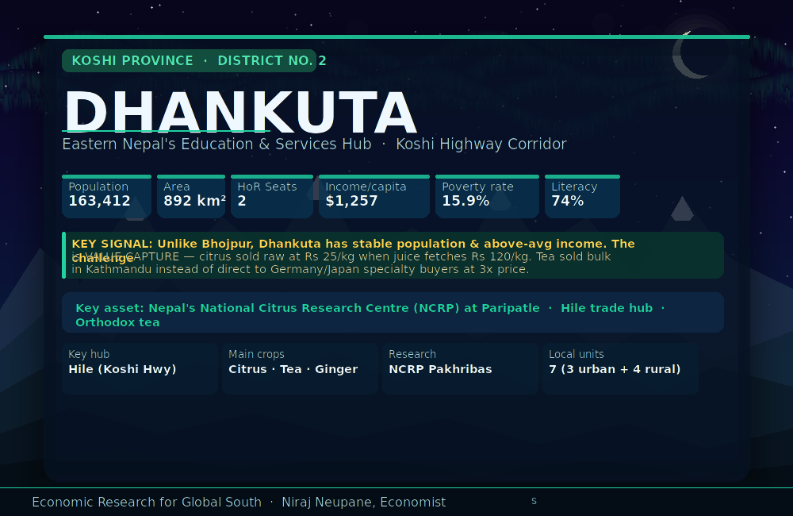

# District 02 — Dhankuta | धनकुटा जिल्ला

**Province:** Koshi | **Ecological Belt:** Hill | **HoR Constituencies:** 2

---

## Quick Stats

| Indicator | Value | Note |
|---|---|---|
| Population (2021 Census) | 163,412 | Relatively stable — unlike Bhojpur |
| Area | 892 km² | 300m – 2,500m elevation |
| HoR Constituencies | 2 | Dhankuta-1 and Dhankuta-2 |
| Literacy rate | 74% | Near national average |
| Income per capita | $1,257 | Above national average ($1,057) |
| Poverty rate | 15.9% | Below national 20.3% |
| Local government units | 7 | 3 urban + 4 rural municipalities |
| Administrative HQ | Dhankuta Municipality | |
| Key corridor | Koshi Highway | Hile trade junction |
| Key research asset | NCRP Paripatle | National Citrus Research Programme |

**Core development challenge:** Unlike Bhojpur where outmigration is the primary signal, Dhankuta's challenge is **value capture**. The district produces mandarin oranges, orthodox tea, and ginger — but sells them raw to traders at a fraction of the processed value. Nepal's national citrus research centre has been at Pakhribas since 1971, yet farmers still struggle with post-harvest losses and market access.

---

## Animated District Profiles

| Language | File |
|---|---|
| English | [dhankuta_en.gif](assets/dhankuta_en.gif) |
| नेपाली | [dhankuta_np.gif](assets/dhankuta_np.gif) |

---

## Existing Income Sources

| Source | Details | Status |
|---|---|---|
| **Mandarin / Junar orange** | NCRP at Paripatle · avg yield 10.15 t/ha · major rural cash crop | Commercial — but sold raw |
| **Orthodox tea (Hile)** | One of Nepal's 4 key orthodox tea districts · NTIS 2023 priority export | Commercial — middleman dependent |
| **Ginger** | Key cash crop across hill municipalities | Semi-commercial |
| **Vegetables** | Cauliflower, cabbage, seasonal vegetables | Subsistence + local market |
| **Education & services** | Eastern Nepal hub · Pakhribas Agri Centre (92 ha) · hospitals · colleges | Stable |
| **Hile trade corridor** | Koshi Highway junction — transit to Sankhuwasabha, Bhojpur, Solukhumbu, Taplejung | Active but informal |
| **Remittances** | Household income stabiliser | Structural dependency |
| **Tourism (emerging)** | Ramche Danda (Makalu views) · Tamor river · Kirat/Limbu culture | Nascent |

---

## Infrastructure — Current State

| Infrastructure | Status | Gap |
|---|---|---|
| Road access | Koshi Highway main artery; Hile is a major junction | Last-mile rural connectivity incomplete |
| Electricity | Grid accessible across urban municipalities | Rural municipalities still patchy |
| Cold storage | **Absent at scale** | Major post-harvest loss on citrus, ginger |
| Citrus processing | NCRP research exists but **no commercial processing plant** | 50-year research asset not connected to output chain |
| Tea processing | Small-scale garden processing | No premium packaging or GI registration |
| Land administration | **Digitisation initiated Feb 2026** (Dhankuta, Mahalaxmi, Pakhribas) | First hilly district to implement — scale district-wide |

---

## Priority Development Interventions

| # | Intervention | Description | Timeline | Priority |
|---|---|---|---|---|
| 1 | **Citrus processing + juice plant** | Mandarin juice, dried peel, essential oil, concentrate — leverage NCRP base at Paripatle | Year 1–2 | 🔴 High |
| 2 | **Orthodox tea direct export** | GI brand ("Hile Orthodox") · premium packaging · direct EU/Japan/USA buyer linkages | Year 1–3 | 🔴 High |
| 3 | **Cold storage + Hile logistics hub** | Citrus, ginger, tea — Hile's transit position on Koshi Highway is ideal location | Year 1–2 | 🔴 High |
| 4 | **Land digitisation (scale up)** | Dhankuta, Mahalaxmi, Pakhribas already started Feb 2026 — extend to all 7 local units | Year 1 | 🔴 High |
| 5 | **Ramche Danda eco-resort circuit** | Resort under development — link Hile tea walk, Tamor river, Kirat Chasok festival | Year 2–4 | 🟡 Medium |
| 6 | **Pakhribas agri-tech & skills centre** | Expand NCRP's 92-ha campus into regional agri-tech training hub for 11 districts | Year 2–4 | 🟡 Medium |
| 7 | **Hile trade zone formalisation** | Formalise Hile as eastern hills trade hub — warehousing, customs, e-commerce node | Year 3–5 | 🔵 Long-term |

---

## Market Opportunities

### 🍊 Mandarin / Junar Orange
- **Price:** Rs 25–40/kg fresh farm gate · Rs 80–120/kg processed juice · Rs 4,000–6,000/litre peel essential oil
- **Domestic:** Kathmandu wholesale, hotel/restaurant sector, juice processors
- **Export:** India (current border trade), Middle East diaspora, EU specialty fruit
- **Opportunity:** NCRP-certified varieties → juice concentrate + essential oil → $3–5/litre export. Mandarin peel oil is a niche high-value product (Rs 4,000–6,000/litre) — currently zero production from Dhankuta.

### 🍵 Orthodox Tea (Hile)
- **Price:** $8–15/kg orthodox bulk · $30–80/kg premium specialty · Spring flush commands 3x premium
- **Export markets:** Germany, USA, Japan, UK, Australia — specialty tea markets
- **Online platforms:** Teabox, Adagio — pay advances on confirmed orders (direct buyer financing)
- **Opportunity:** D2B (direct to buyer) bypasses Kathmandu middlemen. Once Hile Orthodox Tea registers GI, EXIM Bank Nepal pre-shipment credit becomes available. Japanese market has strong interest in tea-origin tourism packages.

### 🌿 Ginger
- **Price:** Rs 40–80/kg fresh · Rs 300–500/kg dried · 5–8x value-add through processing
- **Export:** India (dominant), Bangladesh, Middle East
- **Opportunity:** Dried ginger + powder + ginger oil at Hile cold chain hub = 5–8x price premium over raw. Currently sold raw to traders with no value addition.

### 🏔 Eco-Cultural Tourism
- **Target price:** $60–100/night · $400–700 multi-day circuit package
- **Source markets:** India & SAARC (31%), Europe (UK, Germany, France), Japan (tea-origin tourism)
- **Opportunity:** Bundle — Hile tea walk + Ramche Danda sunrise (Makalu/Gaurishankar views) + Tamor river + Kirat Chasok festival = Rs 20,000–30,000 package. Ramche Danda resort development is already underway.

---

## Employment Potential — 6-Year Outlook

| Sector | Direct Jobs | Notes |
|---|---|---|
| Citrus processing + juice plant | 400–600 | 2,000+ farm income gains |
| Tea processing + direct export | 300–500 | Processing, logistics, packaging |
| Hile trade & logistics zone | 300–600 | Warehousing, wholesale, retail |
| Eco-cultural tourism circuit | 200–350 | Guides, homestay, F&B |
| Ginger + other agro-processing | 150–250 | Drying, grinding, packaging |
| **Total** | **1,350–2,300** | **Value-capture focused** |

---

## Financing Sources

| Source | Type | How to Access |
|---|---|---|
| **ADB Agriculture Value Chain (AVCCSP)** | International | Directly funds citrus, tea, ginger value chains in eastern Nepal — Dhankuta eligible. Requires local government proposal. |
| **Federal conditional grants FY2026/27** | Government | Agro-processing zones + cold storage in hill districts earmarked — budget opened May 11, 2026. |
| **NARC / NCRP institutional funding** | Government R&D | UK/USAID historical funding — expand NCRP to agri-tech training + processing demonstration units. |
| **Nepal Infrastructure Bank (NIFRA)** | Project finance | Cold storage, juice plant, Hile logistics hub — long-tenor debt. Requires bankable feasibility study. |
| **3% Startup Concessional Loans** | Government | Rs 730M national pool — citrus, tea, ginger processing SMEs directly eligible. |
| **Tea buyer pre-payment + EXIM** | Trade finance | Specialty buyers (Teabox, Adagio) pay advances · GI registration unlocks EXIM Bank Nepal pre-shipment credit. |
| **GI export + D2B trade finance** | Export finance | Post-GI → mandarin oil + tea direct buyer credit. D2B online sales require no external financing once first contract is signed. |

---

## Priority Scoring

| Intervention | Impact | Feasibility | Speed | Score |
|---|---|---|---|---|
| Citrus processing + juice | ★★★★★ | ★★★★☆ | ★★★★☆ | 90 |
| Tea direct export + GI | ★★★★★ | ★★★★☆ | ★★★★☆ | 87 |
| Cold storage Hile hub | ★★★★☆ | ★★★★★ | ★★★★★ | 85 |
| Land digitisation | ★★★★☆ | ★★★★★ | ★★★★★ | 82 |
| Ramche Danda tourism | ★★★★☆ | ★★★★☆ | ★★★☆☆ | 70 |
| Pakhribas agri-tech | ★★★★★ | ★★★☆☆ | ★★★☆☆ | 68 |
| Hile trade zone | ★★★★★ | ★★★☆☆ | ★★☆☆☆ | 62 |

---

## Dhankuta vs Bhojpur — Development Contrast

| Dimension | Bhojpur (D01) | Dhankuta (D02) |
|---|---|---|
| Core challenge | Outmigration | Value capture |
| Population trend | ↓ 13% (2011–2021) | Stable |
| Income per capita | National avg | Above national avg |
| Research infrastructure | Limited | NCRP (50 years, 92 ha) |
| Key asset untapped | Khukuri export channel | Citrus/tea processing chain |
| Quick win | Chili processing unit | Citrus juice plant |
| Long-term anchor | Lower Arun 679 MW | Hile trade zone |

---

## Data Sources

| Data | Source |
|---|---|
| Population & demographics | [CBS Nepal Census 2021](https://cbs.gov.np) |
| Mandarin production & marketing | [IDEAS/ZBFABM Research 2024](https://ideas.repec.org) — 93 mandarin growers surveyed |
| National Citrus Research Programme | [NCRP Dhankuta](https://www.ncrpdhankuta.narc.gov.np/en) |
| Orthodox tea export data | [Nepal Economic Forum — Tea Sector 2024](https://nepaleconomicforum.org) |
| Tea districts & seasons | [Tea Journey — Nepali Tea 2022](https://teajourney.pub) |
| Ramche Danda tourism | [Rising Nepal Daily Nov 2025](https://risingnepaldaily.com/news/71337) |
| Land digitisation initiative | [Nepal News Economic Brief Feb 2026](https://english.nepalnews.com) |
| District demographics | [Wikipedia — Dhankuta District](https://en.wikipedia.org/wiki/Dhankuta_District) |
| Investment opportunities | [Invest Koshi Province](https://invest.koshi.gov.np/projectdownload/14) |

---

*Profile completed: May 2026 | Part of the 77-district Nepal Economic Development Research series*
*Researcher: Niraj Neupane — Economic Research for Global South*
