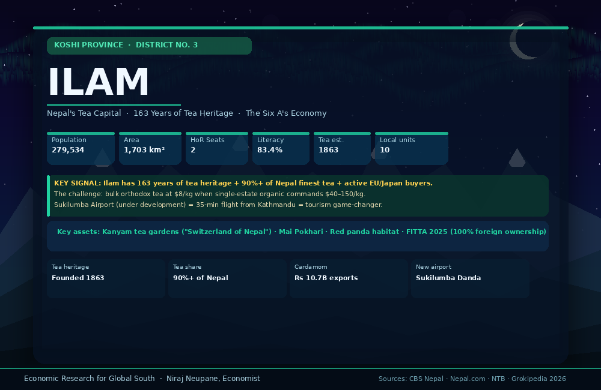

# District 03 — Ilam | इलाम जिल्ला

**Province:** Koshi | **Ecological Belt:** Hill | **HoR Constituencies:** 2

---

## Quick Stats

| Indicator | Value | Note |
|---|---|---|
| Population (2021 Census) | 279,534 | Slight decline from 290,254 (2011) |
| Area | 1,703 km² | 200m – 3,636m elevation |
| HoR Constituencies | 2 | Ilam-1 and Ilam-2 |
| Literacy rate | 83.4% | Well above national average |
| Local government units | 10 | 4 urban + 6 rural municipalities |
| Largest ethnicity | Rai 20% | Limbu 17% · Brahmin 14% |
| Tea estate founded | 1863 | 163 years of heritage |
| New airport | Sukilumba Danda | Under development — transformational |

**Core development challenge:** Ilam is Nepal's most commercially mature hill district in agriculture — over 90% of Nepal's finest tea is cultivated here. The challenge is moving from bulk orthodox tea exports at $8/kg to premium single-estate organic at $40–150/kg, and converting unstructured tourism into a certified, year-round revenue stream.

---

## Animated District Profiles

| Language | File |
|---|---|
| English | [ilam_en.gif](assets/ilam_en.gif) |
| नेपाली | [ilam_np.gif](assets/ilam_np.gif) |

---

## The "Six A's" — Existing Income Sources

| Source | Details | Status |
|---|---|---|
| **Orthodox Tea** | Nepal's primary tea district — 90%+ of finest tea. Kanyam, Mai valley. Founded 1863. Floral, fruity, muscatel notes. Organic estates growing. | Commercial — bulk price |
| **Cardamom (Alainchi)** | World's largest cardamom producer at 55% of global supply. Record Rs 10.70 billion exports in 9M FY2025/26 (+71% YoY). | Commercial — booming |
| **Akabare Chili (Akabare)** | High-altitude variety. Proven US export demand with confirmed reorders. GI co-brand opportunity with Bhojpur. | Semi-commercial |
| **Potato (Aalu)** | Premium high-altitude seed potato — commands higher prices than plains varieties. | Commercial |
| **Broom Grass (Amriso)** | Processed into brooms. Exported to India and regional markets. Low-input, reliable income. | Commercial |
| **Eco-Tourism** | Kanyam ("Switzerland of Nepal") · Mai Pokhari · Red panda habitat · Women-led homestays already operating. | Nascent |

---

## Priority Development Interventions

| # | Intervention | Description | Timeline | Priority |
|---|---|---|---|---|
| 1 | **Premium/organic tea + single-estate export** | GI certification · organic cert · single-estate branding → $40–150/kg vs $8 bulk | Year 1–2 | 🔴 High |
| 2 | **Structured tea tourism circuit** | Kanyam–Mai Pokhari–Ilam certified trail + tea-picking experience + homestay grading | Year 1–3 | 🔴 High |
| 3 | **Sukilumba Airport leverage** | Pre-build tourism + cargo export packages before airport opening | Year 1–3 | 🔴 High |
| 4 | **Cardamom processing cluster** | Ride the Rs 10.7B record boom — processing, packaging, direct export | Year 1–2 | 🔴 High |
| 5 | **Women's cooperative scale-up** | Formalise co-ops · certify homestays · link to international buyers | Year 1–3 | 🟡 Medium |
| 6 | **Red panda eco-corridor tourism** | Mai Pokhari biodiversity corridor — conservation premium tourism + research partnerships | Year 2–4 | 🔵 Long-term |

---

## Market Opportunities

### 🍵 Orthodox & Organic Tea
- **Price:** $8–15/kg bulk · $40–120/kg single-estate · $50–150/kg organic certified
- **Domestic:** Kathmandu premium cafes, hotels, online D2C
- **Export:** Germany, USA, Japan, UK, Australia, South Korea
- **Fair trade:** $0.50–2.00/kg premium above market + advance financing
- **Opportunity:** Single-estate + organic certification = 5–10x bulk price. Darjeeling comparison positions Ilam tea in a massive premium market. Japanese tea-origin tourism drives premium bulk purchase orders.

### 🌿 Large Cardamom
- **Price:** Rs 1,200–2,000/kg · Record Rs 10.70 billion exports FY2025/26 (+71% YoY)
- **Export:** India dominant (re-exports to Pakistan 60%) · Middle East · Bangladesh
- **Opportunity:** Record boom NOW — direct Pakistan/Middle East bypassing India = 30–40% price premium. Ilam processing cluster can capture this wave immediately.

### 🏔 Tea Tourism
- **Target:** $80–150/night · $600–1,200 per tea-circuit package
- **Source markets:** Japan (tea-origin tourism), Germany, UK, India & SAARC (31%)
- **Opportunity:** Sukilumba Airport = 35-minute flight from Kathmandu. Tea-picking experience + Mai Pokhari lake + red panda trail = Rs 30,000–50,000 premium international package.

### 🌶 Akabare Chili
- **Price:** Rs 250–400/kg fresh · Rs 800–1,200/kg dried · US reorders confirmed
- **Opportunity:** Co-brand with Bhojpur GI = "Eastern Nepal Akabare" label. Shared cold storage and processing infrastructure reduces cost for both districts.

---

## Employment Potential — 6-Year Outlook

| Sector | Direct Jobs | Notes |
|---|---|---|
| Premium tea processing & direct export | 500–800 | 5,000+ smallholder farm income gains |
| Structured tea tourism circuit | 400–700 | Guides, homestay, F&B, crafts |
| Cardamom processing cluster | 300–500 | Processing, packaging, export |
| Women's cooperative enterprise | 300–500 | Cooperatives, direct buyer sales |
| Sukilumba Airport + logistics | 200–400 | Aviation, cargo, hospitality |
| **Total** | **1,700–2,900** | **Highest of Koshi series** |

---

## Financing Sources

| Source | Type | How to Access |
|---|---|---|
| **IFC / World Bank — tea value chain** | International | Organic cert, single-estate branding, cold chain eligible. Private tea garden + local govt co-financing. |
| **Nepal Tourism Board** | Government | Tea tourism circuit development + Sukilumba Airport connectivity strengthens NTB investment case. |
| **FITTA 2025 — 100% foreign ownership** | Legal framework | Japanese/German/Korean direct investment in tea processing now fully legal — no joint venture required. |
| **Nepal Infrastructure Bank (NIFRA)** | Project finance | Airport-linked cold storage, tea processing, hospitality infrastructure. |
| **3% Startup Concessional Loans** | Government | Rs 730M pool — tea, cardamom, chili, tourism homestay SMEs all eligible. |
| **Fair trade + buyer pre-payment** | Trade finance | Rainforest Alliance/UTZ certification → EU retailer direct contracts + $0.50–2/kg premium. |
| **GI export + EXIM Nepal** | Export finance | Post-GI → tea + cardamom direct export finance via EXIM Bank Nepal. |

---

## Ilam vs Bhojpur vs Dhankuta — Development Contrast

| Dimension | Bhojpur (D01) | Dhankuta (D02) | Ilam (D03) |
|---|---|---|---|
| Core challenge | Outmigration | Value capture | Premium positioning |
| Commercial maturity | Low | Medium | High |
| Tea industry | None | Emerging (Hile) | 163 years heritage |
| Research infrastructure | Limited | NCRP (50yr) | Market-ready |
| Airport | None | None | Sukilumba (under dev.) |
| FITTA 2025 opportunity | Low | Medium | **Very high** |
| Quick win | Chili processing | Citrus juice plant | Organic certification |
| Long-term anchor | Lower Arun 679 MW | Hile trade zone | Tea tourism + airport |

---

## Data Sources

| Data | Source |
|---|---|
| Population & demographics | [CBS Nepal Census 2021](https://cbs.gov.np) |
| Tea heritage & production | [Meer.com — Ilam Economy 2025](https://www.meer.com/en/83932-ilam-nepal-a-blend-of-land-culture-and-economy) |
| Cardamom export record | [Nepal.com Economy May 2026](https://www.nepal.com/economy/) |
| Six A's agricultural economy | [Kuey Journal — Agro-Tourism Ilam 2024](https://kuey.net/index.php/kuey/article/download/8079/6059/15677) |
| Tourism & Kanyam gardens | [Prayag Samagam Travel Guide 2026](https://prayagsamagam.com/ilam-travel-guide-2025-discover-nepal-tea-garden/) |
| District statistics | [Nepalog — Ilam District Introduction](https://nepalog.com/koshi-province/ilam-district/introduction-of-ilam-district/) |
| City profile & airport | [Cities in Nepal — Ilam 2026](https://www.citiesinnepal.com/city/ilam) |
| FITTA 2025 framework | [Nepal.com Economy 2026](https://www.nepal.com/economy/) |

---

*Profile completed: May 2026 | Part of the 77-district Nepal Economic Development Research series*
*Researcher: Niraj Neupane — Economic Research for Global South*
