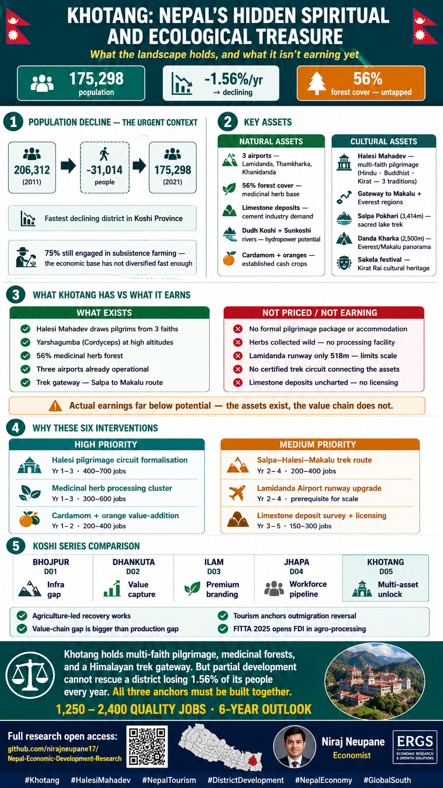

# District 05 — Khotang | खोटाङ जिल्ला

**Province:** Koshi | **Ecological Belt:** Hill | **HoR Constituencies:** 2

---

## Quick Stats

| Indicator | Value | Note |
|---|---|---|
| Population (2021 Census) | 175,298 | Down from 206,312 (2011) — fastest declining in Koshi |
| Annual population growth | -1.56% | Driven by outmigration |
| Area | 1,591 km² | 152m – 3,620m elevation |
| Headquarters | Diktel | Sagarmatha Highway (H09) linkage |
| Local government units | 10 | 2 urban + 8 rural municipalities |
| Forest cover | 56% | Medicinal herb and biodiversity base |
| Cultivated land | 42% | 75% population engaged in farming |
| Airports | 3 | Lamidanda · Thamkharka · Khanidanda |
| Major ethnic group | Rai (Kirat) | + Chhetri, Magar, Tamang, Brahmin |

**Core development challenge:** Khotang is losing population faster than almost any district in Nepal at -1.56% per year. Yet it holds Halesi Mahadev — one of Nepal's most sacred multi-faith pilgrimage sites for Hindus, Buddhists, and Kiratis — alongside 56% forest cover with medicinal herb potential, three airports, and a position as gateway to both Makalu and Everest trekking regions. The challenge is converting these assets into income before the outmigration becomes irreversible.

---

## District Infographics

| Language | Detailed Infographic | Animated Profile |
|---|---|---|
| English | [khotang_chatgpt_en.png](assets/khotang_chatgpt_en.png) | [khotang_en.gif](assets/khotang_en.gif) |
| नेपाली | [khotang_chatgpt_np.png](assets/khotang_chatgpt_np.png) | [khotang_np.gif](assets/khotang_np.gif) |

---

## What Khotang Has vs What It Earns — The Value Gap

| What Exists | Not Priced / Not Earning |
|---|---|
| Halesi Mahadev draws pilgrims from 3 faiths | No formal pilgrimage package or accommodation |
| Yarshagumba (Cordyceps) at high altitudes | Herbs collected wild — no processing facility |
| 56% medicinal herb forest | Lamidanda runway only 518m — limits scale |
| Three airports already operational | No certified trek circuit connecting the assets |
| Trek gateway — Salpa to Makalu route | Limestone deposits uncharted — no licensing |

**Key signal:** Actual earnings far below potential — the assets exist, the value chain does not.

---

## Existing Income Sources

| Source | Details | Status |
|---|---|---|
| **Halesi Mahadev pilgrimage** | Multi-faith site — Hindu, Buddhist, Kirat. At 1,355m, 185km SE of Everest. Lamidanda Airport is its official gateway. | Underdeveloped |
| **Subsistence agriculture** | Rice, maize, millet, potato, wheat, barley. 75% of population engaged. Limited commercialisation. | Subsistence |
| **Cardamom and oranges** | Established cash crops at suitable altitudes. Cardamom benefits from national boom (Rs 10.7B exports FY26, +71%). | Semi-commercial |
| **Medicinal herbs and forest products** | Yarshagumba, Tejpat (bay leaf), Jatamansi, Kutki, Nagbeli — largely unmonetised from 56% forest cover. | Unmonetised |
| **Limestone deposits** | In high demand for Nepal's cement industry. Nationally significant alongside Udayapur and Syangja. | Unlicensed |
| **Trek gateway tourism** | Gateway to Makalu and Everest regions. Temke/Danda Kharka (2,500m) Everest panorama. Salpa Pokhari (3,414m) sacred lake. | Informal |

---

## Priority Development Interventions

| # | Intervention | Description | Timeline | Priority | Jobs |
|---|---|---|---|---|---|
| 1 | **Halesi Mahadev pilgrimage circuit** | Accommodation, trail infrastructure, interpretation, transport from Lamidanda Airport — multi-day pilgrim packages | Year 1–3 | 🔴 High | 400–700 |
| 2 | **Medicinal herb processing cluster** | Cultivated supply → processing (essential oils, dried herbs, extracts) for Ayurvedic and global herbal markets | Year 1–3 | 🔴 High | 300–600 |
| 3 | **Cardamom + orange value-addition** | Ride the national cardamom boom — processing, grading, packaging. Co-develop orange concentrate with Dhankuta NCRP model | Year 1–2 | 🔴 High | 200–400 |
| 4 | **Salpa–Halesi–Makalu trek corridor** | Connect Salpa Pokhari, Halesi Mahadev, Danda Kharka, Makalu Base Camp into certified premium circuit | Year 2–4 | 🟡 Medium | 200–400 |
| 5 | **Lamidanda Airport upgrade** | 518m runway severely limits scale — extension prerequisite for pilgrimage tourism growth | Year 2–4 | 🟡 Medium | 100–200 |
| 6 | **Limestone deposit survey + licensing** | Commission deposit survey → structured extraction → supply to Koshi Province cement industry | Year 3–5 | 🟡 Medium | 150–300 |

---

## Market Opportunities

### 🛕 Halesi Pilgrimage and Cultural Tourism
- **Target price:** Rs 8,000–20,000 per pilgrim package (2–3 nights) · Premium trek: $400–900 Salpa–Makalu circuit
- **Domestic:** Hindu, Buddhist, Kirat pilgrims from across Nepal
- **Export:** India (Hindu/Buddhist diaspora) · Japan (Buddhist cultural tourism) · European spiritual travel
- **Opportunity:** Halesi Mahadev draws from three religious traditions simultaneously — a formal pilgrimage package (Lamidanda flight + accommodation + guide + Salpa Pokhari extension) can command Rs 15,000–25,000 from domestic pilgrims.

### 🌿 Medicinal Herbs and Essential Oils
- **Price:** Yarshagumba: Rs 800,000–1,200,000/kg at export · Tejpat: Rs 80–120/kg · Jatamansi: Rs 200–400/kg · Essential oils: $20–80/100ml
- **Domestic:** Kathmandu Ayurvedic market, herbal pharmacies
- **Export:** India (Ayurveda) · China (TCM) · Europe/USA (essential oils, nutraceuticals)
- **Opportunity:** Global herbal medicine market growing at 8–10% annually. FITTA 2025 allows 100% direct foreign investment in herbal processing — German or Indian Ayurvedic companies can set up certified extraction facilities without a JV.

### 🍊 Cardamom and Specialty Spices
- **Price:** Cardamom Rs 1,200–2,000/kg · Timur (Sichuan pepper) Rs 400–800/kg · Oranges Rs 25–80/kg fresh → Rs 80–120/kg processed
- **Export:** India · Pakistan · Middle East · EU specialty food
- **Opportunity:** Co-brand with Bhojpur and Dhankuta for an "Eastern Nepal Spice Corridor" GI — shared processing and cold storage infrastructure across three districts.

### ⛏ Limestone and Construction Minerals
- **Market:** High national demand — Nepal's construction boom ongoing
- **Domestic:** Udayapur Cement, Koshi Province construction
- **Opportunity:** Deposit survey + extraction licensing unlocks a steady domestic revenue stream independent of outmigration reversal.

---

## Employment Potential — 6-Year Outlook

| Sector | Direct Jobs | Notes |
|---|---|---|
| Halesi pilgrimage + cultural tourism | 400–700 | Guides, accommodation, F&B, crafts |
| Medicinal herb processing | 300–600 | Cultivation, extraction, export |
| Cardamom + orange cluster | 200–400 | Processing + 3,000+ farm income gains |
| Trek corridor — Salpa–Makalu | 200–400 | Guides, teahouses, porters |
| Limestone + construction minerals | 150–300 | Mining, transport, processing |
| **Total** | **1,250–2,400** | Enough to slow outmigration — not reverse it without all three anchors |

---

## Financing Sources

| Source | Type | Application |
|---|---|---|
| **Nepal Tourism Board** | Government | Halesi Mahadev + Salpa Pokhari + Makalu circuit — bankable pilgrimage product |
| **FITTA 2025 — herbal FDI** | Legal framework | 100% foreign ownership in herbal processing — German/Indian/Chinese firms eligible |
| **ADB agriculture value chain** | International | Cardamom, herbs, high-value hill crops across multiple elevation zones |
| **3% startup concessional loans** | Government | Rs 730M pool — herb SMEs, pilgrimage accommodation, teahouse upgrades |
| **40% agri-investment support** | Government (Budget FY2082/83) | Cardamom processing, orange concentrate, herb extraction facilities |
| **NIFRA — Lamidanda Airport** | Project finance | Runway extension as tourism infrastructure — prerequisite for pilgrimage scale |

---

## Koshi Series Comparison

| Dimension | Bhojpur D01 | Dhankuta D02 | Ilam D03 | Jhapa D04 | Khotang D05 |
|---|---|---|---|---|---|
| Core challenge | Infra gap | Value capture | Premium branding | Workforce pipeline | Multi-asset unlock |
| Geography | Hill | Hill | Hill | Terai | Hill |
| Primary anchor | Chili + Hydro | Citrus + Tea | Orthodox Tea | Industrial Park | Halesi + Herbs |
| FITTA 2025 use | Low | Medium | Very high | High | High (herbs) |
| Population trend | Declining | Stable | Slight decline | Growing | Fastest declining |
| 6-yr employment | 1,600–2,900 | 1,350–2,300 | 1,700–2,900 | 4,400–8,550 | **1,250–2,400** |

**Cross-series lessons:**
- Agriculture-led recovery works when value chain is built — not just production
- Tourism anchors outmigration reversal more effectively than remittances
- FITTA 2025 opens FDI in agro-processing for all hill districts
- Value-chain gap is consistently bigger than the production gap

---

## Data Sources

| Data | Source |
|---|---|
| Population & demographics | [CBS Nepal Census 2021](https://cbs.gov.np) |
| Population decline context | [Economic Frontline — Nepal Census 2021](https://www.economicfrontline.com/2025/12/population-data-of-nepal-2078-bs-2021-ad.html) |
| District overview | [Grokipedia — Khotang District 2026](https://grokipedia.com/page/Khotang_District) |
| Tourism and cultural heritage | [Duke Nepal Tour — Khotang](https://www.dukenepaltour.com/blog-details/khotang) |
| Halesi Mahadev temple | [Nepal Database — Khotang](https://www.nepaldatabase.com/explore-the-natural-beauty-and-cultural-heritage-of-khotang) |
| Limestone deposits | [Nepal News — Mining opportunities](https://english.nepalnews.com/s/long-reads/exploring-nepal-business-opportunities-in-agriculture/) |
| Agriculture base | [Biskoon — Khotang District](https://biskoon.com/khotang) |
| Trekking routes | [Hop Nepal — Khotang District 2025](https://www.hopnepal.com/blog/khotang-district-eastern-nepal) |

---

*Profile completed: June 2026 | Part of the 77-district Nepal Economic Development Research series*
*Researcher: Niraj Neupane — Economic Research for Global South*
