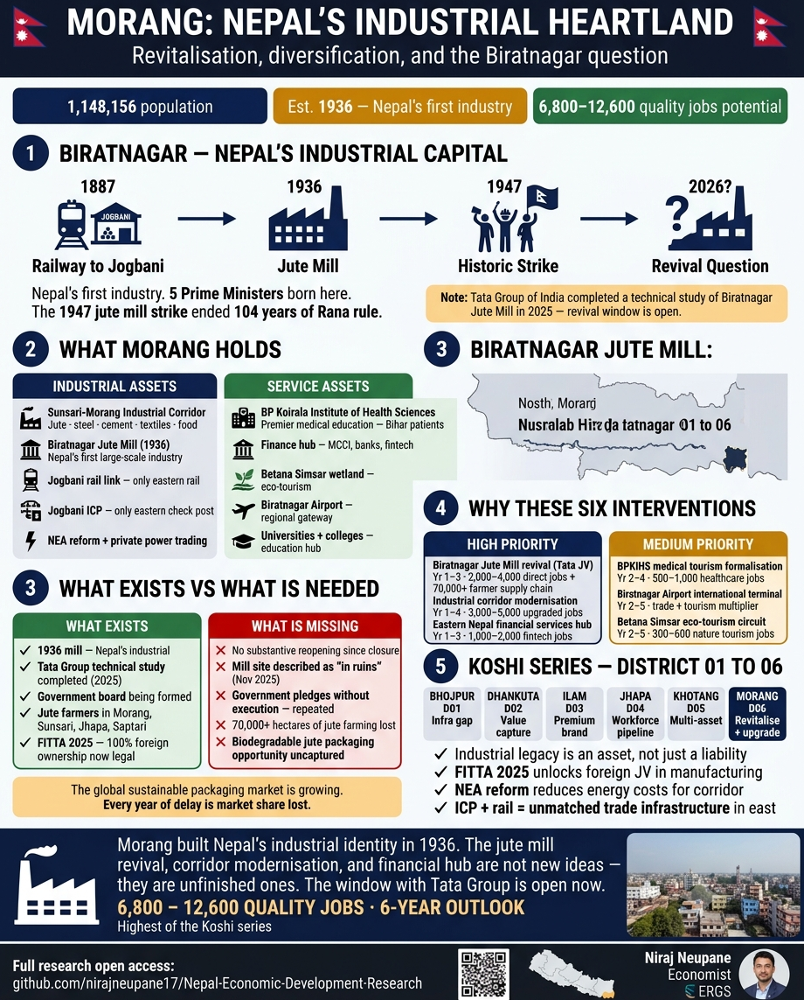

# District 06 — Morang | मोरङ जिल्ला

**Province:** Koshi | **Ecological Belt:** Terai | **HoR Constituencies:** 6

---

## Quick Stats

| Indicator | Value | Note |
|---|---|---|
| Population (2021 Census) | 1,148,156 | 2nd most populous Koshi district |
| Biratnagar metro population | 270,000+ | 3rd largest city in Nepal |
| Area | 1,855 km² | 60m – 2,410m elevation |
| Local government units | 17 | 1 metro + 8 urban + 8 rural |
| Industry founded | 1936 | Nepal's first large-scale industry |
| ICP with India | Jogbani | Only integrated check post in eastern Nepal |
| Rail link | Jogbani–KTM | 2nd Nepal city with Indian rail connection |
| Province capital | Biratnagar | Administrative HQ of Koshi Province |
| HoR Constituencies | 6 | Largest in Koshi Province |

**Core development challenge:** Morang is Nepal's industrial heartland — but the challenge is not building from scratch. It is revitalisation, modernisation, and diversification. Biratnagar Jute Mill, Nepal's first large-scale industry established in 1936, lies closed. Tata Group of India completed a technical study in 2025 and expressed interest in revival. FITTA 2025 now makes 100% foreign ownership in processing legal. The window is open — the question is whether it gets used.

---

## District Infographics

| Language | Detailed Infographic |
|---|---|
| English | [morang_chatgpt_en.png](assets/morang_chatgpt_en.png) |
| नेपाली | [morang_chatgpt_np.png](assets/morang_chatgpt_np.png) |

---

## Biratnagar — Nepal's Industrial Capital

| Year | Event | Significance |
|---|---|---|
| 1887 | Railway to Jogbani completed | Connected eastern Nepal to India's rail network |
| 1936 | Biratnagar Jute Mill established | Nepal's first large-scale registered industry |
| 1947 | Historic jute mill strike | Sparked the movement that ended 104 years of Rana rule |
| 2025 | Tata Group technical study | Revival window opened — government forming new board |
| 2026 | FITTA 2025 in effect | 100% foreign ownership in processing now legal |

Biratnagar has produced more Prime Ministers than any city outside Kathmandu — BP Koirala, Nepal's first democratically elected PM, was born here. The 1947 jute mill strike that ignited the anti-Rana democracy movement began on these factory floors.

---

## Existing Income Sources

| Source | Details | Status |
|---|---|---|
| **Sunsari-Morang Industrial Corridor** | Nepal's largest industrial concentration outside KTM. Jute, steel, cement, textiles, food processing. Major groups: Golchha, CG, Kabra, Rathi headquartered here. | Active — needs modernisation |
| **Agriculture — rice, wheat, jute, sugarcane** | Fertile Terai plains. Jute historically a key cash crop (supported 70,000+ ha nationally from Biratnagar Jute Mills demand). Strong agro-processing base. | Commercial |
| **Trade and commerce** | Jogbani ICP — only integrated check post in eastern Nepal. Biratnagar-Jogbani rail link. Cross-border trade gateway. | Active |
| **Education and health** | BP Koirala Institute of Health Sciences (BPKIHS) — premier medical education. Eastern Nepal's educational and healthcare hub. | Active |
| **Finance and banking** | Headquarters of multiple banks and FIs serving eastern Nepal. MCCI active. Growing fintech. Province administrative economy. | Growing |
| **Nature tourism** | Betana Simsar wetland (East-West Highway) — popular Terai wildlife. Hasina Simsar. Baraah wetlands. | Informal |

---

## What Exists vs What Is Needed — The Jute Mill Question

| What Exists | What Is Missing |
|---|---|
| 1936 mill — Nepal's industrial heritage | No substantive reopening since closure |
| Tata Group technical study completed (2025) | Mill site described as "in ruins" (Nov 2025) |
| Government board being formed | Government pledges without execution — repeated |
| Jute farmers in Morang, Sunsari, Jhapa, Saptari | 70,000+ hectares of jute farming lost |
| FITTA 2025 — 100% foreign ownership now legal | Biodegradable jute packaging opportunity uncaptured |

**Key signal:** The global sustainable packaging market is growing as EU plastic regulations tighten. Every year of delay is market share lost. A revived Biratnagar Jute Mill with modern biodegradable product lines could capture this market alongside traditional output.

---

## Priority Development Interventions

| # | Intervention | Description | Timeline | Priority | Jobs |
|---|---|---|---|---|---|
| 1 | **Biratnagar Jute Mill revival — Tata Group JV** | Tata Group completed technical study. FITTA 2025 enables 100% foreign ownership. Revives Nepal's first industry + jute as cash crop across 4 districts | Year 1–3 | 🔴 High | 2,000–4,000 direct + 70,000+ farmer supply chain |
| 2 | **Industrial corridor modernisation** | Sunsari-Morang corridor upgrade — energy efficiency, automation, quality upgrading for export competitiveness via NEA private power trading | Year 1–4 | 🔴 High | 3,000–5,000 |
| 3 | **Eastern Nepal financial services hub** | Province capital + ICP + rail + industrial base = natural fintech and financial services cluster for eastern Nepal's 8M+ population | Year 1–3 | 🔴 High | 1,000–2,000 |
| 4 | **BPKIHS medical tourism formalisation** | BPKIHS already draws Bihar patients — structured packages, specialist expansion, international accreditation | Year 2–4 | 🟡 Medium | 500–1,000 |
| 5 | **Biratnagar Airport international terminal** | International terminal connects Biratnagar to Kolkata, Patna, Delhi — enabling trade, tourism, diaspora | Year 2–5 | 🟡 Medium | 500–800 |
| 6 | **Betana Simsar eco-tourism circuit** | Betana + Koshi Tappu Wildlife Reserve (Sunsari border) + Baraah wetlands — certified Terai nature circuit | Year 2–5 | 🟡 Medium | 300–600 |

---

## Market Opportunities

### 🏭 Industrial Manufacturing — Export Diversification
- **Current:** ~88% of industrial output absorbed by India
- **Target:** Bangladesh, Bhutan, China border; EU and US via specialised channels
- **Opportunity:** Sunsari-Morang corridor with upgraded energy (NEA reform + private power trading) + modernised equipment + FITTA 2025 FDI = competitive manufacturing for regional export beyond India.

### 🌿 Jute and Eco-Products
- **Products:** Jute gunny sacks, hessian cloth, twine + new biodegradable packaging
- **Export:** India (historical) · EU/US (sustainable packaging boom) · Bangladesh (premium products)
- **Opportunity:** EU plastic packaging regulations driving global demand for sustainable alternatives. Revived Biratnagar Jute Mill with modern biodegradable product lines captures this market.

### 🏦 Financial Services — Eastern Nepal Hub
- **Catchment:** 8M+ eastern Nepal population
- **Market:** SME finance, trade finance via Jogbani ICP, remittance services
- **Opportunity:** NRB fintech marketplace (Budget FY2082/83) + province capital position + ICP trade finance = natural eastern Nepal fintech cluster. Credit scoring for industrial SMEs unlocks formal finance.

### 🏥 Medical and Education Services Export
- **Base:** BPKIHS already an eastern Nepal hub
- **Export:** Bihar and Jharkhand (India) — specialist healthcare at competitive prices
- **Opportunity:** Larger catchment than Birtamod's eye hospital cluster. Biratnagar closer than Kathmandu or Kolkata for Bihar patients seeking specialist care.

---

## Employment Potential — 6-Year Outlook

| Sector | Direct Jobs | Notes |
|---|---|---|
| Jute mill revival + supply chain | 2,000–4,000 | Direct + 70,000+ farmer income gains |
| Industrial corridor modernisation | 3,000–5,000 | Manufacturing + logistics + services |
| Financial services hub | 1,000–2,000 | Finance, fintech, professional services |
| BPKIHS medical tourism | 500–1,000 | Healthcare, hospitality, transport |
| Airport + nature tourism | 300–600 | Aviation, tourism, hospitality |
| **Total** | **6,800–12,600** | **Highest of Koshi series — Biratnagar's scale drives everything** |

---

## Financing Sources

| Source | Type | Application |
|---|---|---|
| **Tata Group India — Jute Mill JV** | Foreign investment | FITTA 2025 enables 100% ownership — no government JV required |
| **IFC / ADB — industrial corridor** | International | Established industrial base + province capital = strong investment case |
| **NRB fintech marketplace** | Regulatory (Budget FY2082/83) | Province capital positioning for eastern Nepal fintech cluster |
| **NIFRA — airport international terminal** | Project finance | Province capital + ICP city = direct government backing case |
| **NEA private power trading** | Policy (Budget FY2082/83) | Sunsari-Morang corridor companies contract directly with private hydropower |
| **MCCI — investment facilitation** | Industry body | Morang Chamber of Commerce conduit between industrial groups and policy |

---

## Koshi Series Comparison — Districts 01 to 06

| Dimension | Bhojpur D01 | Dhankuta D02 | Ilam D03 | Jhapa D04 | Khotang D05 | Morang D06 |
|---|---|---|---|---|---|---|
| Core challenge | Infra gap | Value capture | Premium branding | Workforce pipeline | Multi-asset unlock | Revitalise + upgrade |
| Geography | Hill | Hill | Hill | Terai | Hill | Terai |
| Primary anchor | Chili + Hydro | Citrus + Tea | Orthodox Tea | Industrial Park | Halesi + Herbs | Jute Mill + Corridor |
| FITTA 2025 use | Low | Medium | Very high | High | High | **Critical (Tata JV)** |
| Population trend | Declining | Stable | Slight decline | Growing | Fastest declining | Growing |
| 6-yr employment | 1,600–2,900 | 1,350–2,300 | 1,700–2,900 | 4,400–8,550 | 1,250–2,400 | **6,800–12,600** |

**Cross-series lessons:**
- Industrial legacy is an asset, not just a liability
- FITTA 2025 unlocks foreign JV in manufacturing — the legal barrier is gone
- NEA reform reduces energy costs for the industrial corridor
- ICP + rail = unmatched trade infrastructure in eastern Nepal

---

## Data Sources

| Data | Source |
|---|---|
| Population & demographics | [CBS Nepal Census 2021](https://cbs.gov.np) |
| District overview | [Nepalog — Morang District Introduction](https://nepalog.com/koshi-province/morang-district/introduction-of-morang-district/) |
| Biratnagar city profile | [Grokipedia — Biratnagar 2026](https://grokipedia.com/page/Biratnagar) |
| Biratnagar Jute Mill history | [Grokipedia — Biratnagar Jute Mill 2025](https://grokipedia.com/page/biratnagar_jute_mill) |
| Jute Mill revival — Tata Group | [New Business Age — July 2025](https://newbusinessage.com/news/21671/foreign-companies-show-interest-in-resuming-biratnagar-jute-mill/) |
| Industrial corridor | [Project Birat — Sunsari-Morang Corridor](https://projectbirat.com/) |
| Morang Chamber of Commerce | [MCCI](https://morangcci.org.np/about) |
| Jute Mill closure | [Corporate Nepal — Jan 2026](https://english.corporatenepal.com/news/detail/21446/) |

---

*Profile completed: July 2026 | Part of the 77-district Nepal Economic Development Research series*
*Researcher: Niraj Neupane — Economic Research for Global South*
