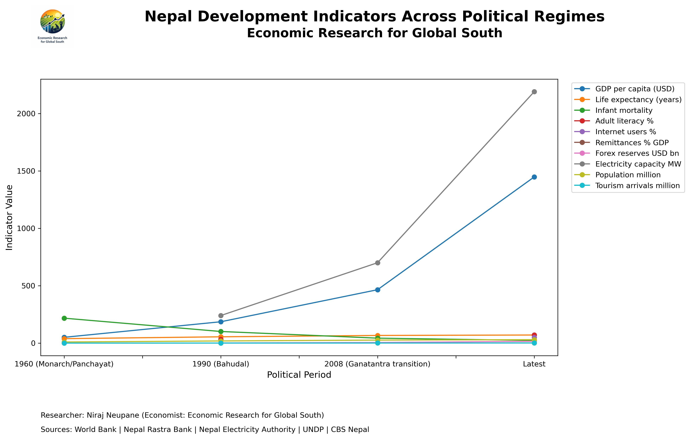
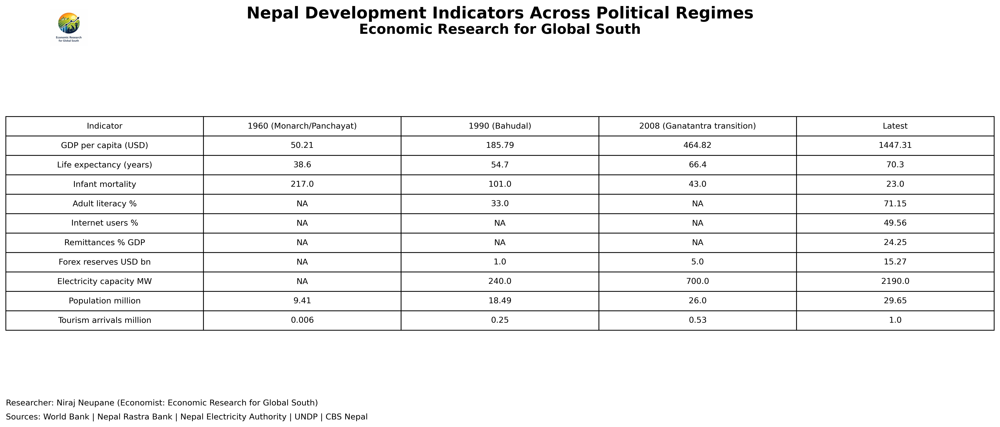

# Macro Analysis — Nepal Development Indicators

## Nepal Development Indicators Across Political Regimes

This analysis tracks key economic and social indicators across Nepal's four major political periods.

## Key Findings

**GDP per capita** grew from $50 (1960) to $1,447 (latest) — a 29x increase, with most gains occurring post-2008 Ganatantra transition.

**Electricity capacity** is the most dramatic change — from essentially zero to 2,190 MW (now 3,602 MW as of 2025), and growing at 21% annually.

**Life expectancy** nearly doubled — from 38.6 years under the Panchayat system to 70.3 years today, driven by healthcare access and poverty reduction.

**Infant mortality** fell from 217 per 1,000 live births (1960) to 23 — a 90% reduction.

**Remittances** now represent 33% of GDP (FY2025/26) — the highest on record and the dominant macroeconomic stabilizer.

## Data Table

| Indicator | 1960 (Monarch/Panchayat) | 1990 (Bahudal) | 2008 (Ganatantra) | Latest |
|---|---|---|---|---|
| GDP per capita (USD) | 50.21 | 185.79 | 464.82 | 1,447.31 |
| Life expectancy (years) | 38.6 | 54.7 | 66.4 | 70.3 |
| Infant mortality (per 1,000) | 217.0 | 101.0 | 43.0 | 23.0 |
| Adult literacy (%) | NA | 33.0 | NA | 71.15 |
| Internet users (%) | NA | NA | NA | 49.56 |
| Remittances (% GDP) | NA | NA | NA | 24.25* |
| Forex reserves (USD bn) | NA | 1.0 | 5.0 | 15.27 |
| Electricity capacity (MW) | NA | 240.0 | 700.0 | 2,190+ |
| Population (million) | 9.41 | 18.49 | 26.0 | 29.65 |
| Tourism arrivals (million) | 0.006 | 0.25 | 0.53 | 1.0 |

*\*Now estimated at 33% of GDP for FY2025/26 (NSO preliminary estimates)*

## Sources
- World Bank Open Data
- Nepal Rastra Bank
- Nepal Electricity Authority (NEA)
- UNDP Human Development Reports
- CBS Nepal (Central Bureau of Statistics)
