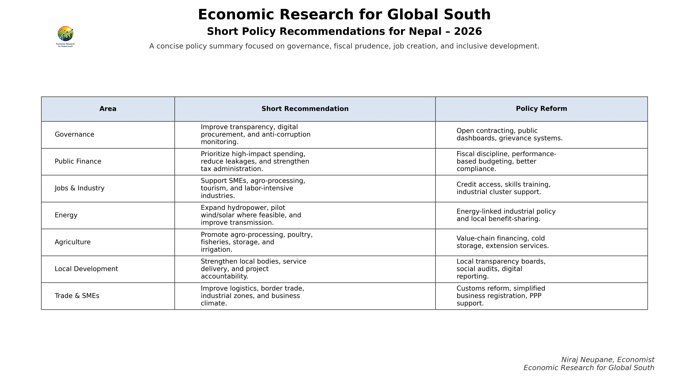

# Short Policy Recommendations for Nepal — 2026

**Economic Research for Global South**
*Niraj Neupane, Economist*

A concise policy summary focused on governance, fiscal prudence, job creation, and inclusive development.

---

## Summary Table

| Area | Short Recommendation | Policy Reform |
|---|---|---|
| **Governance** | Improve transparency, digital procurement, and anti-corruption monitoring | Open contracting, public dashboards, grievance systems |
| **Public Finance** | Prioritize high-impact spending, reduce leakages, strengthen tax administration | Fiscal discipline, performance-based budgeting, better compliance |
| **Jobs & Industry** | Support SMEs, agro-processing, tourism, and labor-intensive industries | Credit access, skills training, industrial cluster support |
| **Energy** | Expand hydropower, pilot wind/solar where feasible, improve transmission | Energy-linked industrial policy and local benefit-sharing |
| **Agriculture** | Promote agro-processing, poultry, fisheries, storage, and irrigation | Value-chain financing, cold storage, extension services |
| **Local Development** | Strengthen local bodies, service delivery, and project accountability | Local transparency boards, social audits, digital reporting |
| **Trade & SMEs** | Improve logistics, border trade, industrial zones, and business climate | Customs reform, simplified business registration, PPP support |

---

## Context

These recommendations were developed alongside a review of the **Rastriya Swatantra Party (RSP) manifesto** and broader reform priorities being discussed in Nepal in 2025–2026. Many themes — improving governance, reducing corruption, strengthening digital public services, and promoting job creation — align broadly with these recommendations.

This is an initial framework, not a final research conclusion. It forms the baseline policy lens through which district-level opportunities are assessed across this research series.

---

## National Priority Sectors (FY2026/27)

Based on the Nepal Government's policies and programs for FY2026/27 (presented May 2026):

1. **Information Technology** — digital public services, IT/BPO export promotion
2. **Tourism** — Tourism Bill 2025, mountaineering regulation modernization
3. **Agriculture** — Minimum Support Price directive 2026, commercialization
4. **Energy** — National Energy Development Decade push (IPPAN recommendation)
5. **Green Industrialization** — boiler modernization ($57M World Bank support)

---

*Part of the Nepal Economic Development Research series*
*Updated: May 2026*
